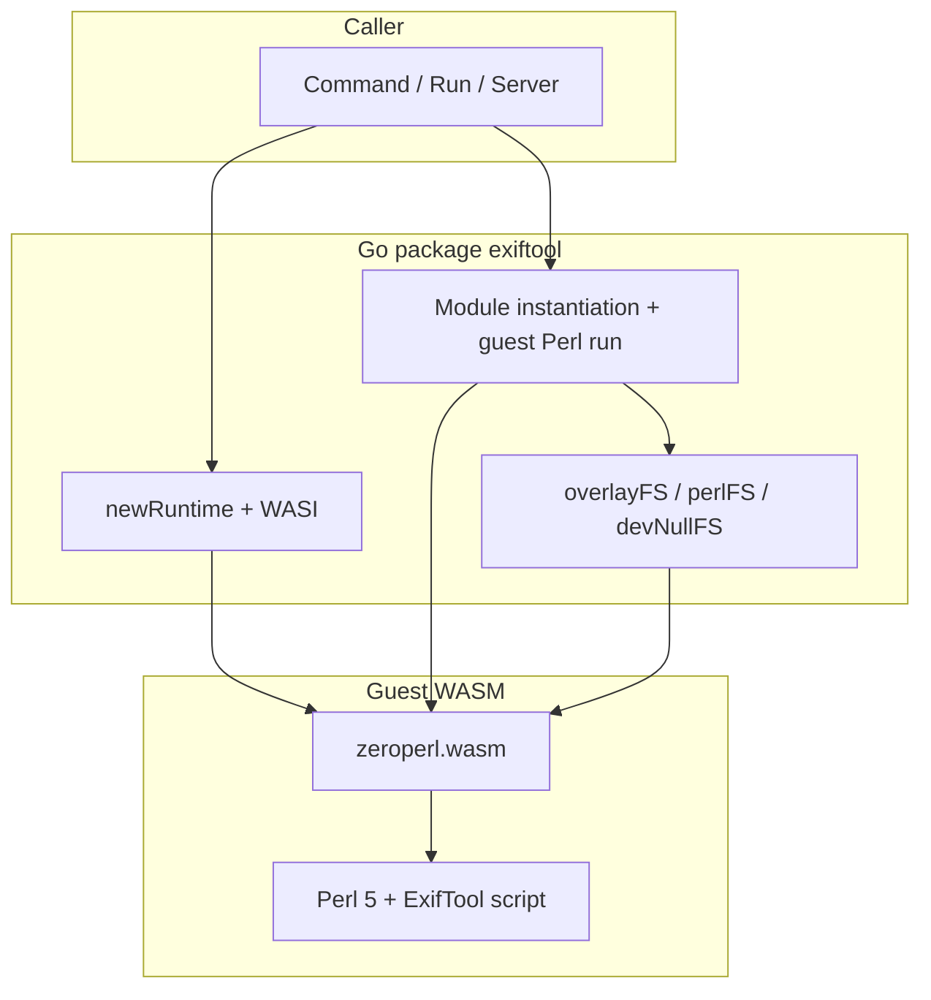
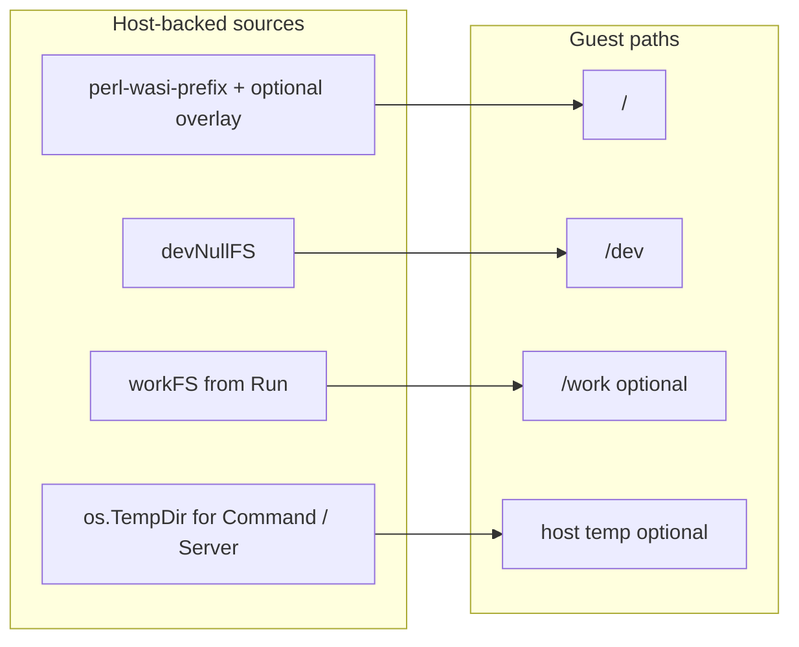
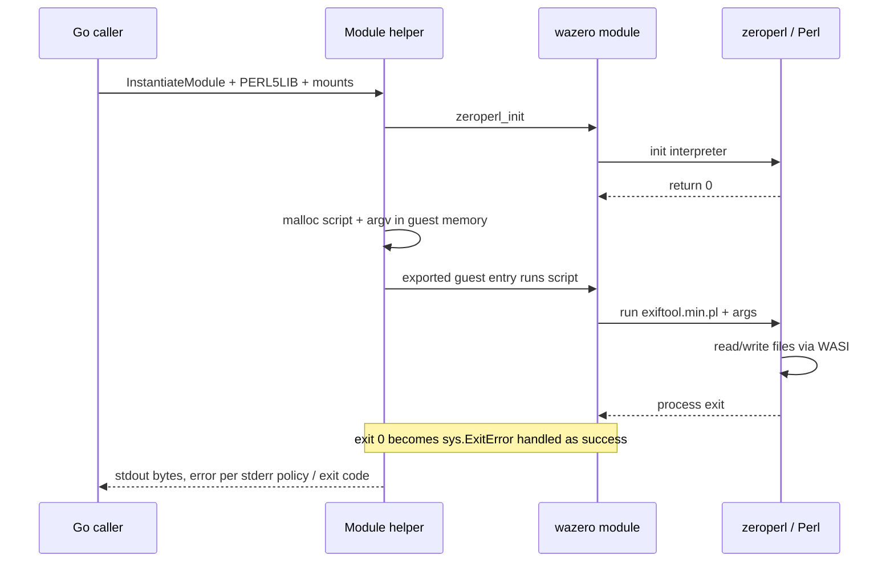
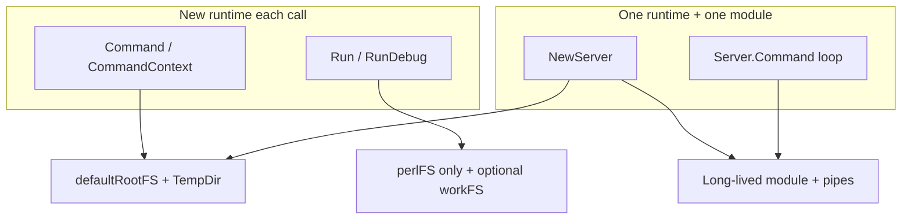
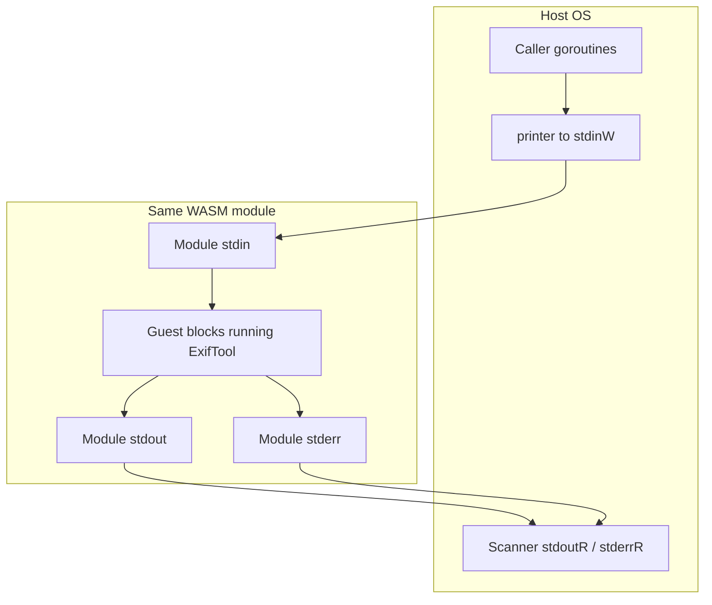

# Architecture: go-exiftool

This document describes how the package is built: what is embedded, how **wazero** runs **zeroperl** (Perl in WebAssembly), how the guest sees the filesystem, and how the **single-shot** APIs differ from the **Server** (`-stay_open`) path.

For rebuilding `embed/` from upstream, see [README.md](README.md) (Development) and [zeroperl](https://github.com/uswriting/zeroperl).

## Goals

- Run **ExifTool** without `os/exec` or a host `exiftool` binary.
- Ship **Perl**, **stdlib**, **Image::ExifTool**, and the **zeroperl** WASM module inside the Go module (`embed/`).
- Offer **drop-in style** APIs: `Command`, `Run`, `NewServer` / `Server.Command`, plus helpers (`Unmarshal`, `printer`).

## Layered stack

## Embedded payload

| Asset | Go binding | Role |
|-------|------------|------|
| `embed/zeroperl.wasm` | `//go:embed` into `wasmBinary` | Perl interpreter (WASI reactor; asyncify build from zeroperl). |
| `embed/perl-wasi-prefix/` | `//go:embed all:` into `perlFSRoot` | Perl `@INC` tree: `lib/<version>/`, `lib/<version>/wasm32-wasi/` (includes `Image::ExifTool`). |
| `embed/exiftool.min.pl` | `//go:embed` into `exiftoolScript` | Minified ExifTool driver script, prefixed at runtime with a small **autoflush** preamble so stdout/stderr flush before `exit(0)`. |

`PERL5LIB` is set inside the module config to `/lib/5.42.0:/lib/5.42.0/wasm32-wasi` (see `exiftool.go` and `server.go`). If you refresh embeds with a different Perl version, these paths must stay consistent with the tree under `embed/perl-wasi-prefix/lib/`.

## Guest filesystem layout (WASI preopens)

The WASM module sees a **virtual root** built from wazero `FSConfig` mounts:

- **`/`**  
  - **`Run`**: `perlFS()` only (embedded prefix rooted at `embed/perl-wasi-prefix`). User files use **`/work/...`** via `workFS`.  
  - **`Command` / `Server`**: `defaultRootFS()` = **`overlayFS`**: first **embedded Perl**, then **`os.DirFS(".")`**. The process **working directory** is therefore visible inside the sandbox (read-through overlay); see package docs for security implications.

- **`/dev`**  
  Minimal **`devNullFS`** (`null` + directory listing for `.`) so Perl can open `/dev/null` without pulling in `testing/fstest` in production code.

- **`/work`**  
  Mounted only when `workFS != nil` in **`evalModule`** (`exiftool.go`), used by `Run` / `RunDebug`.

- **Writable host directory**  
  `Command` and `Server` pass **`[]string{os.TempDir()}`** as writable directory mounts, which becomes a **directory mount** at the same path (host temp for ExifTool writes, sidecar files, etc.).

## Wazero runtime setup

`newRuntime`:

1. Creates a **wazero.Runtime**.
2. Instantiates a tiny **`env`** host module exporting **`call_host_function`** (stub returning `0`; required by the zeroperl build).
3. Instantiates **`wasi_snapshot_preview1`** for filesystem and process syscalls.

Each **single-shot** `Command` / `Run` builds a **new** runtime, **compiles** `wasmBinary` once per call, **instantiates** one module, runs **`zeroperl_init`**, then invokes the guest entry that runs Perl with the embedded script and argv, then closes the module and runtime.

**`Server`** compiles the WASM **once** at `NewServer`, keeps one **`wazero.CompiledModule`**, and uses **one long-lived instantiation** for all stay_open traffic (until restart/shutdown).

## Single-shot guest run (`evalModule` in exiftool.go)

All paths that run ExifTool for a **single process exit** funnel through **`evalModule`** in `exiftool.go` (after `CompileModule`). Sequence:

Implementation notes (see source in `exiftool.go`):

- **Script body**: `scriptPreamble` + `exiftoolScript` (copied into WASM with a trailing NUL).
- **Arguments**: Guest **`malloc`** per string, **`argv`** as `uint32` pointers, freed after the guest returns.
- **Success on `exit(0)`**: Perl’s `exit(0)` surfaces as **`sys.ExitError`** in wazero; non-zero exit and other errors are wrapped and may attach **stderr** text.
- The guest entry symbol name is **`zeroperl_eval`** (exported by zeroperl).

## API shapes compared

| API | Root FS | `/work` | Writable temp | WASM instance |
|-----|---------|---------|---------------|---------------|
| `Command` | `defaultRootFS()` | no | yes | new per call |
| `Run` | `perlFS()` | optional `workFS` | no (unless you extend) | new per call |
| `Server` | `defaultRootFS()` (stored on `Server`) | no | yes | one; stays open |

## Server: `-stay_open` and I/O plumbing

`NewServer` builds argv that includes **`-stay_open true`**, **`-@ -`** (read further args from stdin), **`-common_args`**, and **`-echo4`** with a fixed **`{ready<boundary>}`** marker so each response can be framed on stdout/stderr.

Startup:

1. **Pipes** connect host writers/readers to the module’s stdin/stdout/stderr (host **`stdinW`** receives command lines for the guest).
2. **`zeroperl_init`** on the main setup path.
3. A **dedicated goroutine** invokes **`zeroperl_eval` once** with the full stay_open argv; that call **blocks** until ExifTool exits (normal shutdown or error). While blocked, ExifTool reads **stdin** for `-execute` lines and writes **stdout/stderr**.
4. **`evalDone`** (channel) is closed when that goroutine finishes, signaling end of life.

Per-request **`Server.Command`** (under **`cmdMtx`**):

1. **`printer.print`** writes each argument as a line, then **`-execute<boundary>`**.
2. **`bufio.Scanner`** with **`splitReadyToken`** reads one framed chunk from stdout and one from stderr (delimiter **`{ready1854673209}\n`**).
3. Non-empty stderr chunk → error; else return a **copy** of stdout bytes.

**`Shutdown`** sends **`-stay_open false`**, closes the printer, waits on **`evalDone`**, then **`finalize`** (mark done, close pipe readers, close runtime). **`Close`** forces teardown without the polite stay_open line.

## Concurrency

- **`cmdMtx`**: Serializes **`Server.Command`** so stdin lines and scanner reads do not interleave.
- **`srvMtx`**: Protects **`done`**, **`finalize`**, and coordination with **`Shutdown`** / **`Close`**.
- **`restart()`** (on I/O errors): stops the module and pipes, then **`start()`** again; a stored **`restartErr`** surfaces on the next **`Command`**.

## Supporting Go files

| File | Responsibility |
|------|----------------|
| `exiftool.go` | Embed directives, overlay/devNull/perl FS, `newRuntime`, single-shot module run, `Run` / `RunDebug`. |
| `cmd.go` | `Command` / `CommandContext` wiring. |
| `server.go` | `Server`, pipes, stay_open goroutine, `splitReadyToken`, shutdown/finalize. |
| `printer.go` | Buffered newline writes and sticky error for server stdin. |
| `init.go` | Package doc and `Exec` / `Arg1` / `Config`. |
| `decode.go` | `Unmarshal` for line-oriented ExifTool text output. |

## Related reading

- [README.md](README.md) — usage, tests, refreshing `embed/`.
- [zeroperl](https://github.com/uswriting/zeroperl) — building `zeroperl.wasm` and `perl-wasi-prefix`.
- [wazero](https://wazero.io/) — Go WebAssembly runtime used here.
